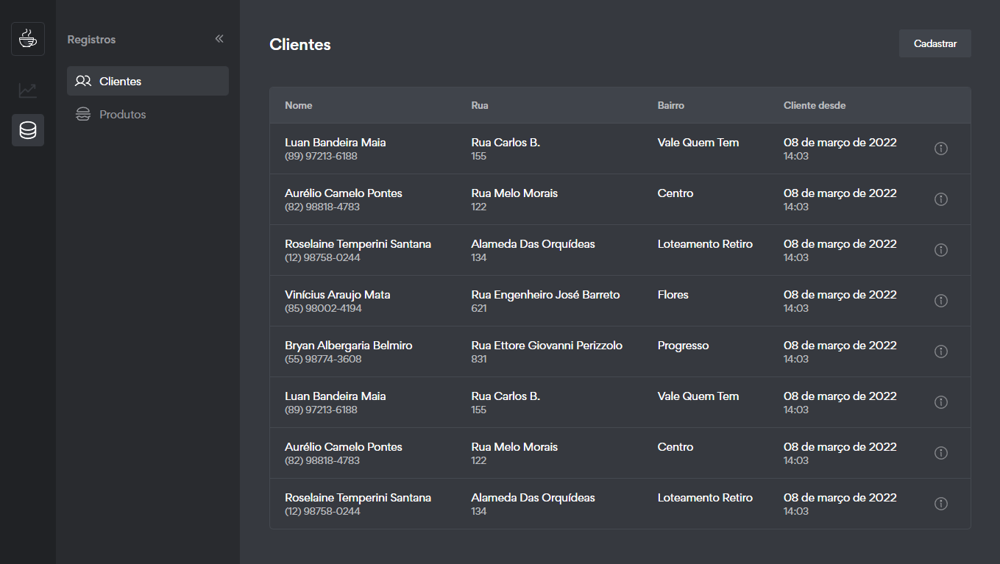
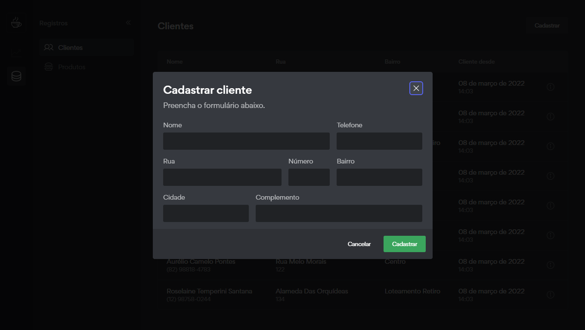
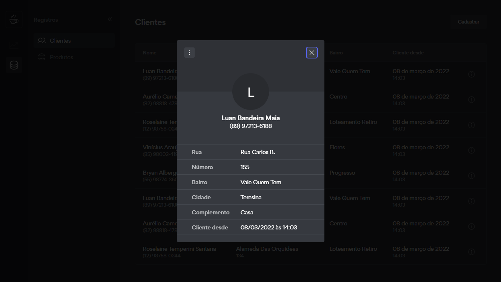
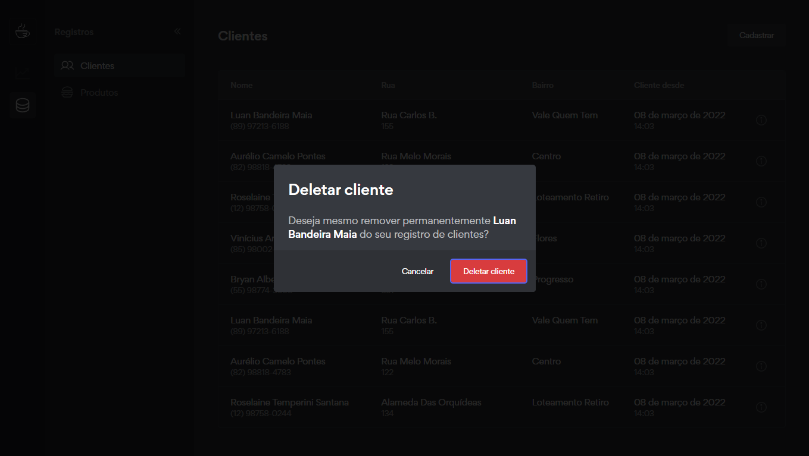

## Ask for food

Ask for food é uma aplicação simples voltada para o segmento da alimentação e do food service.

[](https://github.com/lucaslousada)
[](#)
[](#)
[](#)
[](LICENSE.md)

<p align="center">
  🚧 Em construção... 🚧
</p>
<div style="display: grid; grid-template-areas: '. .' '. .'; gap: 5px;">
  
  
  
  
</div>
<p align="center">
  Layout e código por <a href="https://github.com/lucaslousada">Lucas Lousada</a> | Inspirado no aplicativo <a href="https://discord.com/">Discord</a>
</p>

## Tecnologias

Esse projeto foi desenvolvido com as seguintes tecnologias:

- ReactJS
- TypeScript
- Vite
- React Router Dom
- Axios
- Json Server
- Styled Components
- Formik
- Yup
- Radix UI
- Phosphor Icons
- Polished
- e outros.

## Features

- [x] Listagem de clientes cadastrados.
- [x] Ver detalhes de um cliente.
- [x] Cadastrar, editar e deletar clientes.
- [ ] Listagem de produtos cadastrados.
- [ ] Cadastrar, editar e deletar produtos.
- [ ] Ver detalhes de um produto.
- [ ] Listagem de pedidos realizados.
- [ ] Abrir, finalizar e cancelar um pedido.
- [ ] Ver detalhes de um pedido.
- [x] Ocultar/exibir navegação lateral.
- [x] Página 404.

## Executar o projeto

Você precisa instalar o [Git](https://git-scm.com/downloads) e o [Node.js](https://nodejs.org/en/download/) para executar este projeto.
Você pode usar [Yarn](https://yarnpkg.com/) ou [Npm](https://nodejs.org/en/download/).

```bash
# Clone o projeto e acesse a pasta
git clone https://github.com/lucaslousada/ask-for-food.git && cd ask-for-food
# Instale as dependências
$ yarn
# Inicie a fake api com
$ yarn server
# Inicie o servidor com
$ yarn dev
```

Aplicação: http://localhost:3000  
Fake API: http://localhost:3333

## Licença

Este projeto está licenciado sob a Licença MIT - veja o arquivo [LICENSE](LICENSE.md) para mais detalhes.
